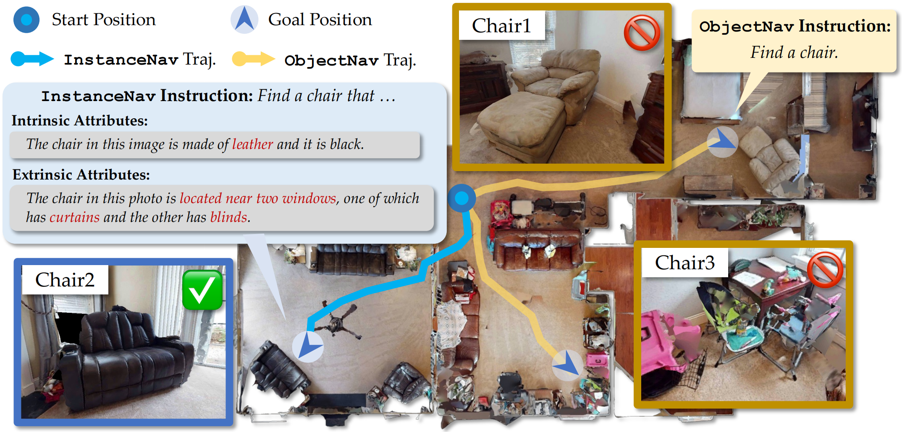
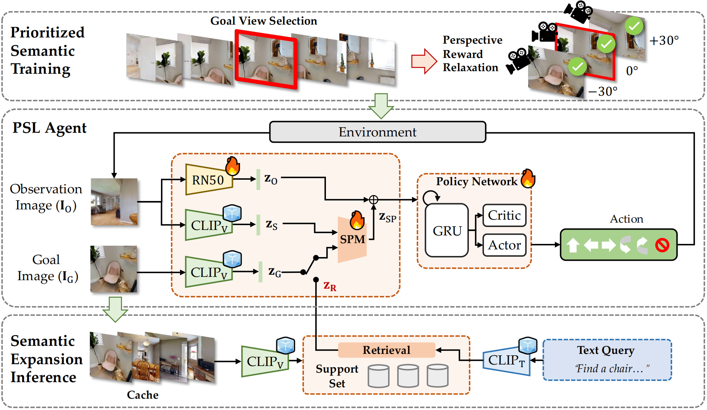

# Prioritized Semantic Learning for Zero-shot Instance Navigation

<!-- Anomoys Authors -->
Xander Sun<sup>1</sup>, Lec Liu, Hoyard Zhi, Ronghe Qiu<sup>1</sup>, and [Junwei Liang<sup>1</sup>](https://junweiliang.me/)

[<sup>1</sup> AI Thrust, The Hong Kong University of Science and Technology (Guangzhou)](https://ait.hkust-gz.edu.cn/)

## Overview
We present PSL, a zero-shot approach for learning instance level navigation skill. The agent is tasked with a language goal to find a specified object in current scene, for example, *a chair made of black leather and is located near two windows.*
<!-- We present a scalable approach for learning open-world object-goal navigation (ObjectNav) – the task of asking a virtual robot (agent) to find any instance of an object in an unexplored environment (e.g., “find a sink”). Our approach is entirely zero-shot – i.e., it does not require ObjectNav rewards or demonstrations of any kind. -->

<p align="center">
   <!-- height="400" -->

  <p align="center"><i>InstanceNav v.s ObjectNav. </i></p>
</p>

Specifically, a semantic enhanced PSL agent is proposed and a prioritized semantic training strategy is introduced to select goal images that exhibit clear semantic supervision and relax the reward function from strict exact view matching. At inference time, a semantic expansion inference scheme is designed to preserve the same granularity level of the goal-semantic as training.

<p align="center">
   <!-- height="400" -->

  <p align="center"><i>Model Architecture for PSL. </i></p>
</p>

## Main Results
### ObjectNav Results
|Methods|with Mapping|with LLM|SR|SPL|
|-|:-:|:-:|:-:|:-:|
|L3MVN|✅|✅|35.2|16.5|
|PixelNav|❌|✅|37.9|20.5|
|ESC|✅|✅|39.2|22.3|
|CoW|✅|❌|6.1|3.9|
|ProcTHOR|✅|❌|13.2|7.7|
|ZSON|❌|❌|25.5|12.6|
|PSL(Ours)|❌|❌|**42.4**|**19.2**|

### InstanceNav Results (Text-Goal)
|Methods|with Mapping|with LLM|SR|SPL|
|-|:-:|:-:|:-:|:-:|
|CoW|✅|❌|1.8|1.1|
|CoW|✅|❌|7.2|4.2|
|ESC|✅|✅|6.5|3.7|
|OVRL|❌|❌|3.7|1.8|
|ZSON|❌|❌|10.6|4.9|
|PSL(Ours)|❌|❌|**16.5**|**7.5**|

## Installation
All the required data can be downloaded from [here](https://huggingface.co/gunjan050/ZSON/tree/main).

1. Create a conda environment:
   ```
   conda create -n psl python=3.7 cmake=3.14.0
   ```
   ```
   conda activate psl
   ```

1. Install [pytorch](https://pytorch.org/) version `1.10.2`:
   ```
   pip install torch==1.10.2+cu113 torchvision==0.11.3+cu113 -i https://download.pytorch.org/whl/cu113
   ```

1. Install habitat-sim:
   ```
   conda install habitat-sim-challenge-2022 headless -c conda-forge -c aihabitat
   ```

1. Install habitat-lab:
   ```
   git clone --branch challenge-2022 https://github.com/facebookresearch/habitat-lab.git habitat-lab-challenge-2022
   ```
   ```
   cd habitat-lab-challenge-2022
   ```
   ```
   pip install -r requirements.txt
   ```
   ```
   python setup.py develop --all # install habitat and habitat_baselines
   ```
   ```
   cd ..
   ```


### Install PSL:
1. Setup steps
   ```
   cd PSL
   ```
   ```
   pip install -r requirements.txt
   ```
   ```
   python setup.py develop
   ```

1. Follow the instructions [here](https://github.com/facebookresearch/habitat-sim/blob/main/DATASETS.md) to set up the `data/scene_datasets/` directory. `gibson` scenes can be found [here](http://gibsonenv.stanford.edu/database/).

2. Download the HM3D objectnav dataset from ZSON.
   ```
   wget https://dl.fbaipublicfiles.com/habitat/data/datasets/objectnav/hm3d/v1/objectnav_hm3d_v1.zip
   ```
   ```
   unzip objectnav_hm3d_v1.zip -d data/datasets/objectnav/
   ```
   ```
   rm objectnav_hm3d_v1.zip  # clean-up
   ```
3. Download the trained checkpoints [PSL_Instancenav.pth](https://drive.google.com/file/d/1fYGxVuDpBQ7CBUVOiHJNH5yA6M1KLFbV/view?usp=drive_link), and move to `data/models`.


<!-- 1. To train policies using OVRL pretrained RGB encoder, download the model weights from [here](https://huggingface.co/gunjan050/ZSON/resolve/main/omnidata_DINO_02.pth) and move to `data/models/`.
More details on the encoder can be found [here](https://arxiv.org/pdf/2204.13226.pdf). -->

1. Setup `data/goal_datasets` using the script `tools/extract-goal-features.py`. This caches CLIP goal embeddings for faster training. 

   Your directory structure should now look like this:
   ```
   .
   +-- habitat-lab-challenge-2022/
   |   ...
   +-- zson/
   |   +-- data/
   |   |   +-- datasets/
   |   |   |   +-- objectnav/
   |   |   |   +-- imagenav/
   |   |   +-- scene_datasets/
   |   |   |   +-- hm3d/
   |   |   |   +-- mp3d/
   |   |   +-- goal_datasets/
   |   |   |   +-- imagenav/
   |   |   |   |   +-- hm3d/
   |   |   +-- models/
   |   |   |   +-- PSL_Instancenav.pth
   |   +-- zson/
   |   ...
   ```

## Evaluation

Evaluate the PSL agent on the ObjectNav task:

```bash
bash scripts/eval/objectnav_hm3d.sh
```

Evaluate the PSL agent on the InstanceNav Text-Goal task:
```bash
bash scripts/eval/instancenav_text_hm3d.sh
```

<!-- ## Citation

If you use this code in your research, please consider citing:
```
@inproceedings{majumdar2022zson,
  title={ZSON: Zero-Shot Object-Goal Navigation using Multimodal Goal Embeddings},
  author={Majumdar, Arjun and Aggarwal, Gunjan and Devnani, Bhavika and Hoffman, Judy and Batra, Dhruv},
  booktitle={Neural Information Processing Systems (NeurIPS)},
  year={2022}
}
``` -->
